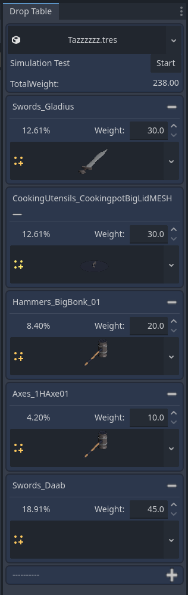
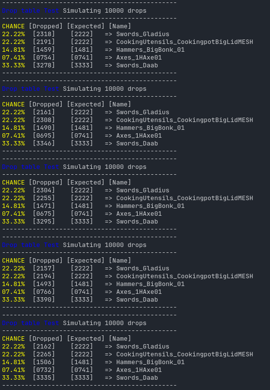

# MDropTables

v1.1

Editor tooling to create and edit and run drop tests on weighted drop tables.

   

# Install ( Written in C#. Needs the Mono version of Godot to run)

Place all repo files in /addons/MDropTables
Compile
Activate the plugin in project settings

# How to use
Create DropTableResource resource. It will hold the data needed to read and use the table in runtime.
The addon has adock that you then load the resource in and add/remove drop entries.
The weight is relative to the total weight in the table. So when anything changes the table is recalculated.
Making sure the % shown is accurate.

Use the Test button to test how the numbers stack up. It constructs a table and pulls 10k random drops and presents the result
in Output.

In runtime create an instance of DropTable. Passing the DropTableResource you want to use as the parameter.
Then ask the DropTable instance for drop. Easy as that.


```cs
        dropTable = new DropTable(dropTableResource);
		DropEntry loot = dropTable.GetDrop();
        // loot.Drop is the resource
```


